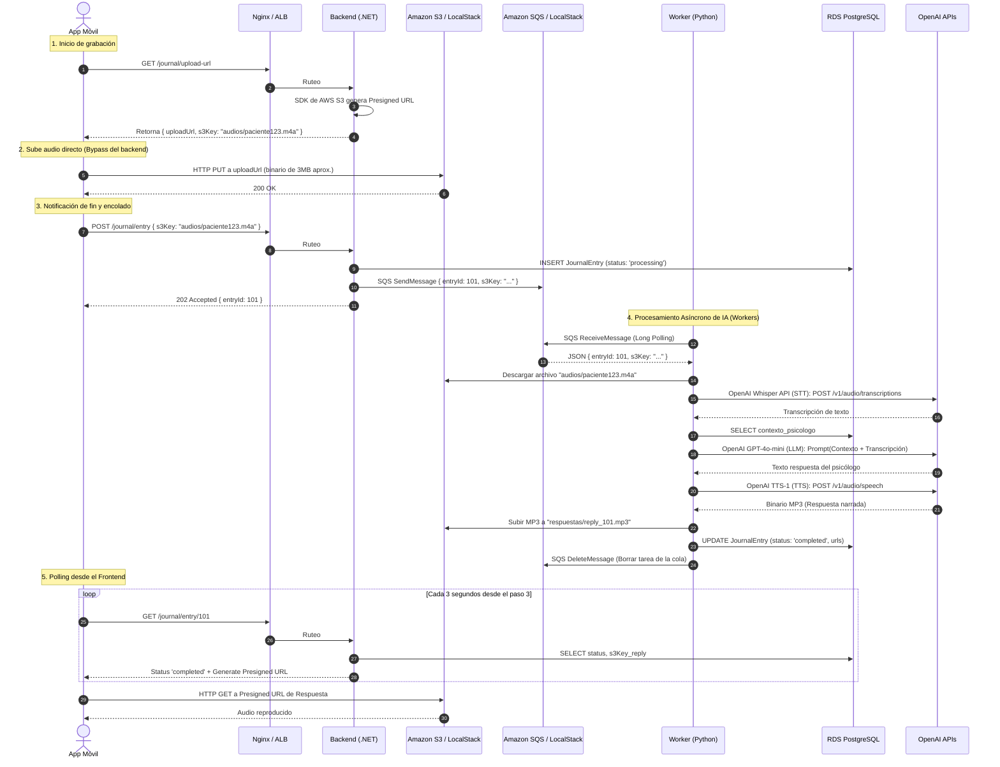
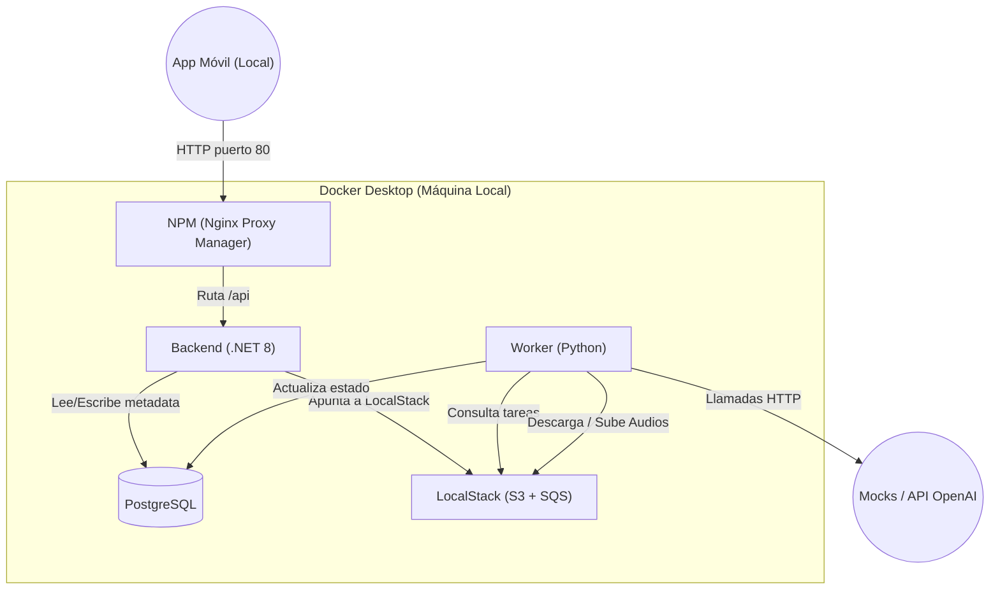
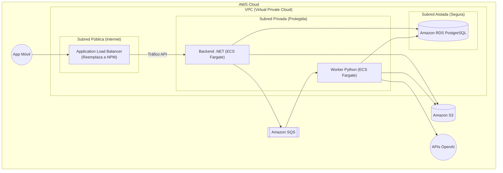

* [ ] erdock

# Arquitectura y Diseño Detallado para Journal Psicológico

---

## 1. Diagrama Lógico: Flujo de la Aplicación Paso a Paso (Secuencia)

    ---

## 2. Diagrama Físico: Entorno Local (Docker)

En local, simularemos todos los servicios usando contenedores. Aquí reintegramos **NPM (Nginx Proxy Manager)** como la puerta de entrada única para el Frontend.

---

## 3. Diagrama Físico: Entorno AWS (Producción)

En AWS, **NPM es reemplazado nativamente por el ALB (Application Load Balancer)**, el cual rutea el tráfico hacia tus contenedores en ECS Fargate.

---

## 4. Resolviendo deudas técnicas (Respuestas y Conceptos)

### A. LocalStack NO es Terraform y NO toca el AWS real

* **Terraform** es código (Infraestructura como Código) que se conecta a internet y *crea* cosas en tu cuenta real de AWS (que cuestan dinero).
* **LocalStack** es simplemente un simulador offline (un emulador). Es como un videojuego de AWS. Se ejecuta 100% dentro del Docker local.
* Para usar LocalStack, al Backend de .NET simplemente se le dice en el archivo `.env` que la URL de S3 no es `aws.com`, sino `http://localstack:4566`. El código de C# seguirá usando el SDK oficial de AWS sin darse cuenta de que está siendo "engañado" y guardando los archivos en el disco duro local.

### B. Nginx Proxy Manager (NPM)

NPM actúa como la puerta de entrada (puerto 80) y redirige todo el tráfico que empiece con `/api/` al contenedor de Backend .NET. Esto evita problemas de CORS en desarrollo para el equipo de Frontend. En AWS, NPM simplemente se reemplaza con el Application Load Balancer de AWS.

---

## 5. Guía Técnica por Servicio (Para el equipo de desarrollo)

Detalle de exactamente qué librerías y técnicas debe usar cada integrante del equipo para lograr el MVP:

### Backend (.NET 8 C#)

* **Librerías a usar:**
  * `AWSSDK.S3` (NuGet) para generar las Presigned URLs.
  * `AWSSDK.SQS` (NuGet) para enviar mensajes a la cola.
  * `Npgsql.EntityFrameworkCore.PostgreSQL` o `Dapper` para conectarse a la Base de Datos.
* **Técnica Clave:** En el `appsettings.Development.json`, deben sobrescribir el `ServiceURL` de AWS para que apunte a `http://localstack:4566`. En producción, simplemente eliminan esa variable y el SDK se conectará al AWS real automáticamente.

### Worker (Python 3.11+)

* **Librerías a usar:**
  * `boto3` (El SDK oficial de AWS para Python). Lo usarán para conectarse a SQS y S3.
  * `psycopg2-binary` o `SQLAlchemy` para consultar la base de datos PostgreSQL.
  * `openai` (Librería oficial para usar Whisper, GPT-4o-mini y TTS).
* **Técnica Clave (Long Polling en SQS):** El script de Python debe hacer un loop infinito (`while True:`). Usarán el método `sqs.receive_message(QueueUrl, WaitTimeSeconds=20)`. Esto hace que Python se quede "dormido" sin consumir CPU hasta que llegue un mensaje. Cuando termine de procesar los audios con OpenAI y guardar en DB, **deben usar `sqs.delete_message`** para decirle a SQS que la tarea se completó y no vuelva a enviarla.

### Frontend (React / React Native / Flutter)

* **Librerías a usar:** Ninguna librería especial de AWS. Solo `axios` o `fetch` nativo.
* **Técnica Clave:** Para subir el archivo a S3, deben usar el método `PUT` hacia la Presigned URL generada por el Backend, enviando el archivo de audio directamente en el `Body` (o usando `multipart/form-data`).
* **Técnica de Polling:** Una vez que reciban el `202 Accepted` del backend, deben crear un `setInterval` que llame al endpoint `GET /journal/entry/{id}` cada 3 o 4 segundos, hasta que el backend responda con el status `completed` y la URL del audio del psicólogo.

### Base de Datos (PostgreSQL)

* **Técnica Clave:** El equipo de Base de Datos debe mantener el índice (`INDEX`) sobre el campo `status` de la tabla de Journals, porque el Frontend va a estar haciendo muchas consultas (Polling) preguntando `WHERE status = 'completed'`. Esto mantendrá la base de datos extremadamente rápida.
