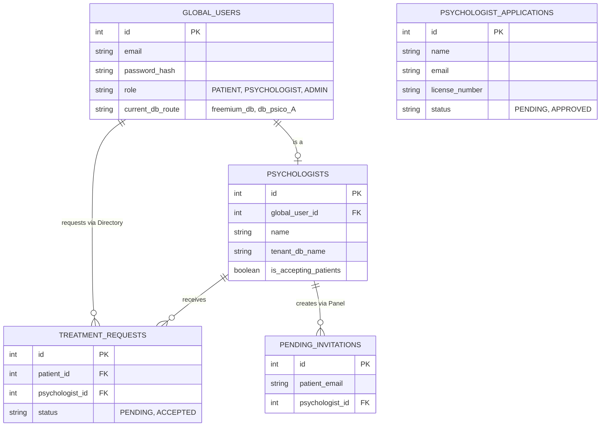
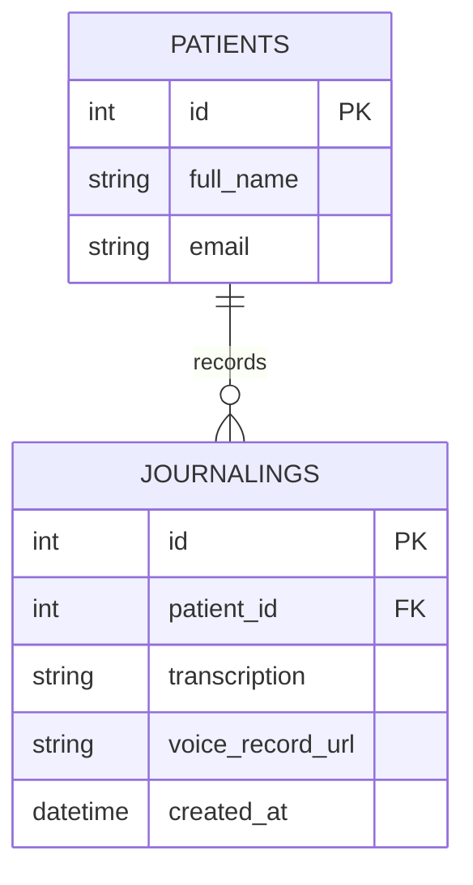
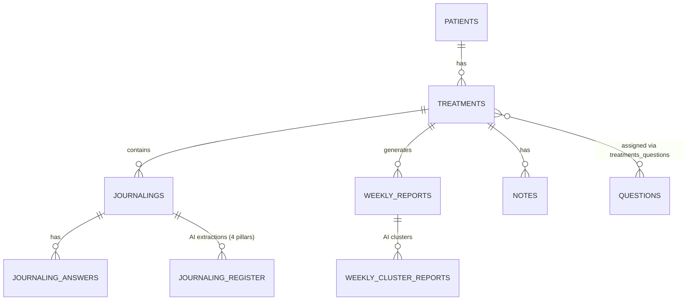
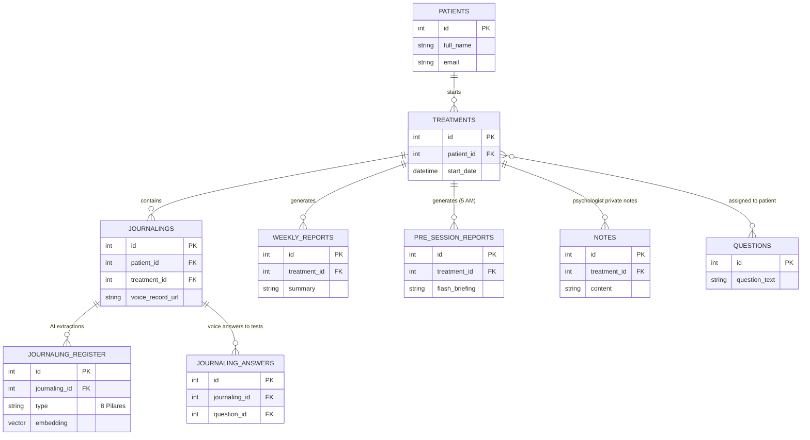

# Plan Maestro de Arquitectura y Negocio (V4.0)

Este documento consolida todas las decisiones técnicas y de negocio. Sirve como la "Biblia" del proyecto.

---

## 1. Fase 1: El "Hot Pipeline" (ESTADO: REFINADO PARA MULTI-TENANT)

El pipeline en caliente ocurre en **tiempo real** mientras el paciente usa la app. El paciente gratuito no debe recibir análisis clínico para no reemplazar al psicólogo ni gastar dinero en OpenAI.

### A. Flujo Detallado del Hot Pipeline

1. **Trigger:** El paciente graba su diario en la app. El Frontend sube el audio a S3 y le avisa al Backend (.NET).
2. **Enrutamiento (Master DB):** El Backend consulta la `Master DB` para saber la ruta del usuario (`tenant_db_name`).
3. **Encolado SQS:** El Backend envía un mensaje a la cola SQS que incluye: `{"audio_url": "s3://...", "tenant_db": "freemium_db", "patient_id": 12}`.
4. **Worker Python:** El worker toma el mensaje y ejecuta Whisper (STT) para transcribir el audio.
5. **Diferenciación de Respuesta (GPT):**
   - **Si `tenant_db` == `freemium_db`:** El Worker le pide a GPT una respuesta *genérica, empática y breve*. Ej: *"Te escucho Juan, parece un día difícil, recuerda respirar"*. (Costos mínimos).
   - **Si `tenant_db` != `freemium_db`:** El Worker puede hacer una respuesta ligeramente más guiada, pero sigue siendo rápida.
6. **Guardado:** El Worker se conecta a la base de datos específica (`freemium_db` o `db_psico_A`) e inserta la fila en la tabla `journalings` con la URL del S3 y el texto transcrito.

---

## 2. Fase 2: Estrategia de Base de Datos y SaaS (Multi-Tenant)

### A. Diagramas y Descripciones por Tipo de Base de Datos

1. Master DB (El Enrutador Global)	

La Master DB es el "directorio telefónico" central. El usuario nunca se borra de aquí.

**Descripción de Tablas (Master DB):**

- **GLOBAL_USERS:** Tabla central de autenticación. Aquí la columna `current_db_route` funciona como semáforo indicando a qué DB enviar al usuario cuando inicia sesión.
- **PSYCHOLOGIST_APPLICATIONS:** Formulario de la Landing Page. Aquí caen los psicólogos que quieren trabajar en la plataforma, esperando aprobación del SuperAdmin.
- **PSYCHOLOGISTS:** El perfil público del psicólogo para el directorio. Guarda el nombre exacto de su base de datos privada (`tenant_db_name`).
- **TREATMENT_REQUESTS:** Las solicitudes entrantes cuando un paciente Freemium presiona "Contactar" en el directorio.
- **PENDING_INVITATIONS:** Las invitaciones privadas que el psicólogo envía a sus pacientes físicos.

#### 2. Freemium DB (El "Sandbox" Gratuito)

No debemos extraer los 8 pilares ni hacer reportes en Freemium para cuidar la economía. La base gratuita es un "diario tonto" con empatía básica.

**Descripción de Tablas (Freemium DB):**

- **PATIENTS:** Copia local de los datos básicos del paciente.
- **JOURNALINGS:** Guarda únicamente la transcripción del STT y la URL de S3. *Nota: No hay tabla de Treatments ni Reportes porque no hay intervención clínica aquí.*

#### 3. Psico_A DB (La Clínica Privada)

Esta es la base de datos "Premium". Antes de ver la versión final, veamos el diseño original de tu compañero para entender la evolución.

**Diagrama Original (Creado por tu compañero):**

**Diagrama Final Evolucionado (Psico_A DB):**
Tal como observaste de forma muy aguda, al haber aislado a los usuarios gratuitos en `freemium_db`, esta base de datos clínica (`db_psico_A`) vuelve a requerir **estrictamente** que todos los pacientes tengan un tratamiento pagado. ¡La visión de tu compañero se mantiene intacta! Cada diario aquí está obligatoriamente amarrado al `treatment_id`. Las únicas adiciones reales son la tabla de Reportes de las 5 AM y los vectores de la IA.

**Descripción de Tablas (Psico_A DB):**

- **PATIENTS & TREATMENTS:** Relación clínica oficial. Ningún paciente entra aquí si no tiene un Treatment.
- **JOURNALINGS:** Obligatoriamente ligado a un `treatment_id`. Guarda la transcripción y el link al audio S3.
- **JOURNALING_REGISTER:** El motor de IA. Guarda los 8 pilares extraídos a las 3 AM y añade una columna `embedding` (VECTOR) para agrupar pensamientos matemáticamente.
- **PRE_SESSION_REPORTS (NUEVA):** Tabla añadida al diseño de tu compañero para alojar el "Flash Briefing" de las 5 AM.
- **WEEKLY_REPORTS & NOTES & QUESTIONS:** Tablas originales de la Fase 1 intactas para el manejo del psicólogo.

### B. El Ciclo de Vida de los Datos (La Regla de Oro Clínica)

Para evitar problemas legales y de integridad referencial, el flujo de los datos del paciente sigue estas reglas inquebrantables:

1. **La Fase Freemium (Inicio):**

   - Juan se registra en la app. La Master DB le asigna la ruta `current_db_route = 'freemium_db'`.
   - Cuando Juan graba audios, el Backend los guarda en `freemium_db`. Allí no existe la tabla "Tratamientos", solo son sus diarios personales.
2. **La Migración "Up" (De Freemium a Premium):**

   - Juan contacta al Psico_A por el directorio y le paga (por fuera). Psico_A presiona "Aceptar" en su panel.
   - **El script ETL en Acción:** El backend se conecta a `db_psico_A` y crea un nuevo registro en la tabla `TREATMENTS` para Juan. Luego, saca todos los diarios de Juan de la `freemium_db` y los **inserta** en `db_psico_A`, amarrándolos a ese nuevo `treatment_id`.
   - **Limpieza:** Se borran las filas de Juan de `freemium_db`. (El archivo MP3 en AWS S3 no se mueve ni se duplica, simplemente la nueva DB asume el control del enlace).
   - **Enrutamiento:** La Master DB actualiza a Juan: `current_db_route = 'db_psico_A'`. A partir del día siguiente, Juan entra directamente al servidor privado de Psico_A.
3. **La Migración "Down" (Deja la Terapia):**

   - Si Juan deja de ir a terapia y Psico_A cierra el tratamiento en su panel.
   - **Enrutamiento:** La ruta de Juan en la Master DB vuelve a ser `current_db_route = 'freemium_db'`.
   - **Bloqueo, NO borrado:** ¡Los datos clínicos de Juan NO se borran de `db_psico_A`! Por ley, el Psico_A es dueño de ese historial médico y debe conservarlo por años en caso de una auditoría legal. Esos datos quedan "congelados" en la DB del psicólogo.
   - **Continuidad para el Paciente:** Para que Juan no vea su app vacía al volver a ser Freemium, el sistema le genera un "Resumen de Cierre de Tratamiento" (un texto) y lo inserta en `freemium_db` como su nuevo punto de partida.

---

## 3. Fase 3: El "Cold Pipeline" (EXCLUSIVO PARA PREMIUM)

Para proteger la economía del negocio y el valor del psicólogo, **este pipeline NUNCA lee la `freemium_db`**.

### Flujo Detallado de la Lambda de las 3 AM:

1. **Trigger:** EventBridge dispara la Lambda a las 3:00 AM.
2. **Descubrimiento:** La Lambda se conecta a la `Master DB` y obtiene una lista de todos los `tenant_db_name` que pertenecen a Psicólogos activos.
3. **Procesamiento por Clínica:** Para cada base de datos (Ej: `db_psico_A`):
   - Busca en la tabla `journalings` todos los diarios insertados el día anterior que aún no tengan extracción.
   - Pasa el bloque de texto por el LLM con un *Prompt Estricto* para sacar los 8 Pilares (Pensamiento, Emoción, Riesgo, etc.).
   - Pasa esos resultados por `text-embedding-3-small`.
   - Escribe el resultado en la tabla `journaling_register` de esa misma `db_psico_A`.

---

## 4. Fase 4: Despliegue y Orquestación en AWS

1. **Lambdas (Dockerizadas):**
   - **Lambda 3 AM:** Extracción y Vectores (Solo Premium).
   - **Lambda Domingos:** Reportes Semanales (Solo Premium).
   - **Lambda Pre-Sesión (5 AM):** Flash Briefing diario (Solo Premium).
   - **Lambda ETL:** Disparada manualmente cuando un usuario cambia de psicólogo para migrar sus `journalings`.
2. **Adminer en ECS:** Interfaz web privada protegida por ALB.

---

## 5. REGLAS DE NEGOCIO Y FLUJOS DE USUARIO (MATCHMAKING)

Usaremos el modelo de **Directorio como Generador de Leads**, sin pasarela de pagos para el MVP.

### A. Flujo de Onboarding del Psicólogo

1. El psicólogo llena un formulario en la Landing Page.
2. Ustedes (SuperAdmin) lo entrevistan. Si pasa, **ustedes mismos crean manualmente su registro** en la Master DB y ejecutan el script para crearle su `db_psico_A`.
3. El psicólogo entra a la app y puede apagar o prender su visibilidad en el Directorio (`is_accepting_patients`).

### B. El "Match" Simple (Sin pasarela de pagos)

- **El Directorio:** Juan (Freemium) entra a la sección "Especialistas". Ve a `Psico_A`. Presiona **"Contactar"**.
- A `Psico_A` le llega un email o notificación: *"Juan quiere iniciar terapia contigo. Su teléfono es X"*.
- `Psico_A` y Juan arreglan el pago por fuera (Efectivo, Zelle, Transferencia).
- Una vez pagado, `Psico_A` entra a su panel y presiona **"Aceptar a Juan"**. En ese momento se dispara la Lambda ETL y la ruta de Juan pasa a `db_psico_A`.

### C. La Invitación Privada

Si `Psico_A` trae a un paciente de su clínica física, entra a su panel, presiona **"Invitar"** y pone el correo. El correo queda en `pending_invitations` de la Master DB. Cuando ese paciente descarga la app y pone ese correo, ¡entra directamente a `db_psico_A`!
