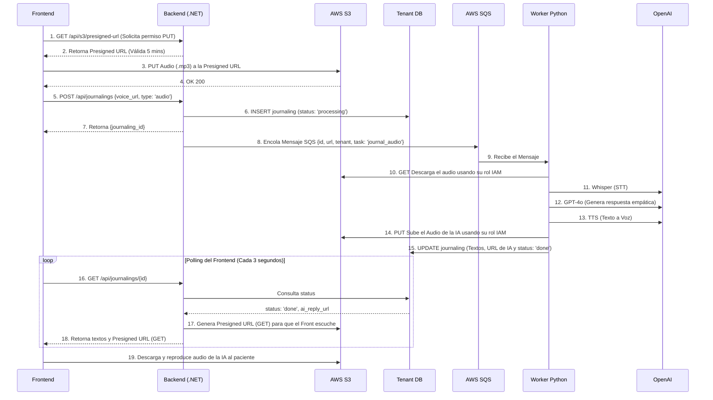
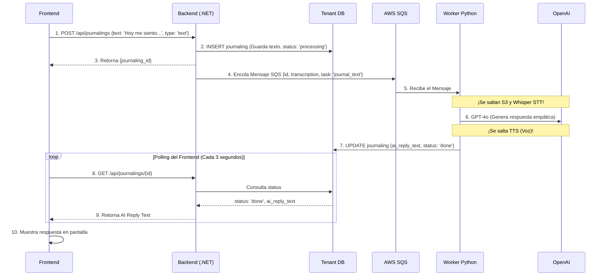
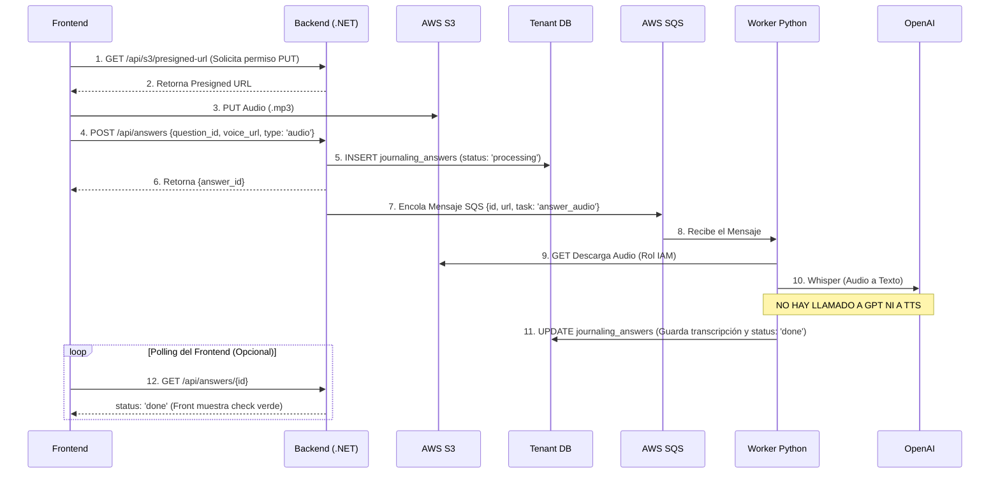
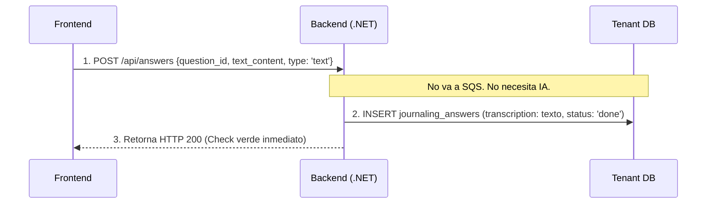
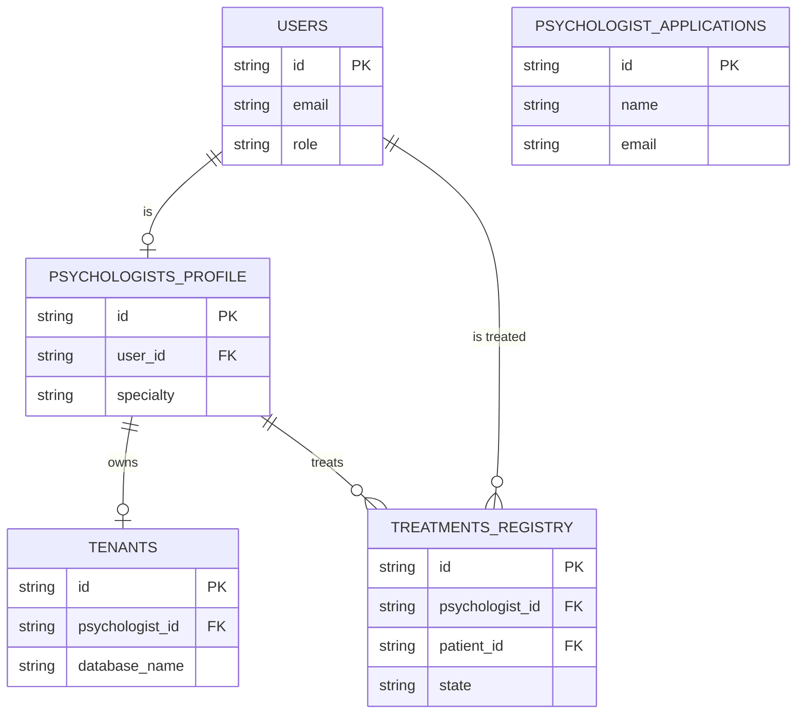
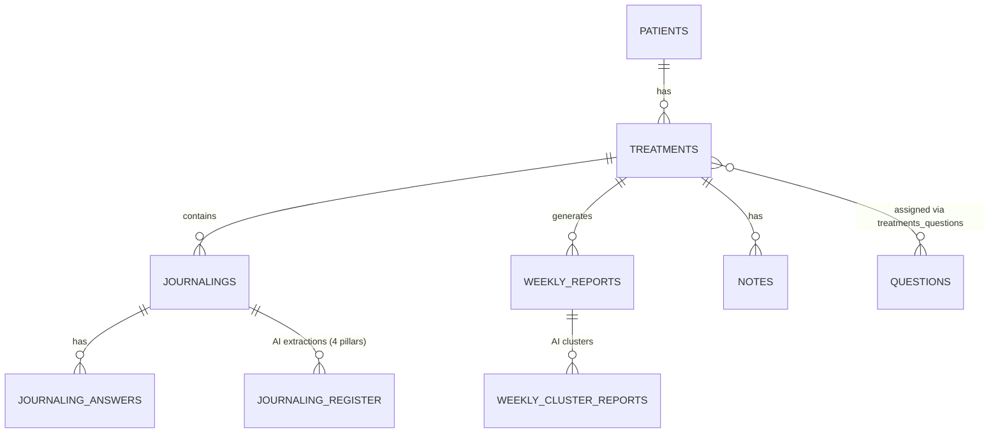
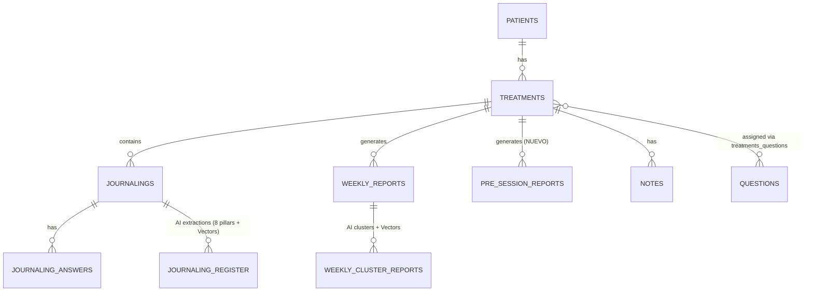

# Diseño Definitivo: Onboarding, Bases de Datos y Multimodalidad (MVP V2)

Este documento incorpora el mayor nivel de detalle técnico, definiendo con exactitud milimétrica la interacción con AWS S3, credenciales, y los flujos de procesamiento en tiempo real (Hot Pipelines) incluyendo el "Camino de Vuelta" hacia el paciente.

---

## 1. Aclaración de Lógicas de Negocio

### A. La Seguridad y las Tablas "Gemelas" (`users` vs `patients`)

**Por temas de seguridad legal (HIPAA/GDPR):**

- **Master DB (`users`):** Es de alto riesgo porque si la hackean, acceden a todos. Por tanto, **solo** debe contener datos de acceso (email, password, nombre). No debe existir ni una sola pista clínica aquí.
- **Tenant DB (`patients`):** Aquí **sí** guardamos la edad, metas principales, estado civil y si vive solo. Esta información de "Perfil Clínico" solo le incumbe al Psicólogo. Al aislar estos datos en la base de datos privada del psicólogo (Tenant DB), minimizamos el riesgo legal.

### B. ¿Cuál es la diferencia entre `journalings` y `journaling_answers`?

- **`journalings` (El Diario Libre):** Es donde el paciente entra a hablar de lo que quiera ("Hoy me sentí mal en el trabajo"). Aquí, **la IA siempre le responde** dándole empatía inmediata.
- **`journaling_answers` (La Tarea Asignada):** Es cuando el psicólogo le deja una pregunta clínica específica (hasta 3 preguntas). El paciente responde (por voz o texto, máximo 1 minuto), pero **la IA no le responde**, solo lo transcribe para que el psicólogo lo lea en su panel.

### C. Sobre `psychologist_applications`

Esta tabla es solo un buzón de sugerencias (Landing Page). No tiene ningún enlace a `users`.

---

## 2. Los Flujos Multimodales (Texto vs Audio) Paso a Paso

Aquí están los 4 diagramas exactos. No asumimos nada: el Frontend usa URLs prefirmadas por el Backend tanto para subir (PUT) como para descargar (GET), y se incluye el **Polling** para saber cuándo la IA terminó de procesar.

### Flujo 1: El Diario por AUDIO (Con camino de vuelta de la IA)



### Flujo 2: El Diario por TEXTO (Con camino de vuelta de la IA)



### Flujo 3: Respuesta a Tareas por AUDIO (Solo Transcripción)



### Flujo 4: Respuesta a Tareas por TEXTO (Súper Optimizado)

*¡Este flujo es la bala de plata! Si el paciente responde la tarea escribiendo, ni siquiera necesitamos usar los Workers ni SQS.*



### Detalles Técnicos Profundos (S3, Credenciales y Nomenclatura)

- **Generación de Presigned URLs (Frontend a S3):** El Frontend de React/Flutter no tiene llaves de AWS. Le pide al Backend una *Presigned URL*. El Backend (usando AWS SDK) crea una URL temporal con método `PUT`. El Frontend usa esa URL para subir el `.mp3` directamente a S3 sin saturar el Backend.
- **Camino de Vuelta (Presigned GET):** Cuando el Frontend necesita reproducir el audio generado por la IA, el Backend le crea otra URL prefirmada, pero esta vez con permiso `GET`.
- **Nomenclatura en S3:** Para organizar los audios, la llave debe seguir el formato: `s3://bucket-name/tenant_name/patient_id/YYYY-MM-DD_uuid.mp3`.
- **Credenciales del Worker (Python):** El Worker corre en AWS ECS. No necesita llaves hardcodeadas en el código. AWS le inyecta un **IAM Task Role** que le da permisos automáticos para hacer `GET` y `PUT` en el bucket de S3 y leer de SQS. Para conectarse a la DB, usa Secrets Manager.

---

## 3. Esquemas DDL Definitivos (Listos para Código)

### A. La MASTER DB (`master_db.sql`)



```sql
-- master_db.sql
CREATE TABLE users (
    id VARCHAR(100) PRIMARY KEY,
    first_name VARCHAR(30) NOT NULL,
    last_names VARCHAR(30) NOT NULL,
    email VARCHAR(60) NOT NULL UNIQUE,
    role VARCHAR(20) NOT NULL, 
    password VARCHAR(200) NOT NULL,
    created_at TIMESTAMP DEFAULT CURRENT_TIMESTAMP,
    updated_at TIMESTAMP DEFAULT CURRENT_TIMESTAMP
);

CREATE TABLE psychologist_applications (
    id VARCHAR(100) PRIMARY KEY,
    name VARCHAR(100) NOT NULL,
    email VARCHAR(60) NOT NULL UNIQUE,
    license_number VARCHAR(50),
    status VARCHAR(20) DEFAULT 'PENDING',
    created_at TIMESTAMP DEFAULT CURRENT_TIMESTAMP
);

CREATE TABLE psychologists_profile (
    id VARCHAR(100) PRIMARY KEY,
    user_id VARCHAR(100) NOT NULL REFERENCES users(id) ON DELETE CASCADE,
    specialty VARCHAR(45),
    profile_photo VARCHAR(255),
    years_experience INT,
    biography VARCHAR(255)
);

CREATE TABLE tenants (
    id VARCHAR(100) PRIMARY KEY,
    psychologist_id VARCHAR(100) NOT NULL REFERENCES psychologists_profile(id) ON DELETE CASCADE,
    domain VARCHAR(45),
    database_name VARCHAR(45) NOT NULL UNIQUE,
    state VARCHAR(20) DEFAULT 'ACTIVE'
);

CREATE TABLE treatments_registry (
    id VARCHAR(100) PRIMARY KEY,
    psychologist_id VARCHAR(100) NOT NULL REFERENCES psychologists_profile(id),
    patient_id VARCHAR(100) NOT NULL REFERENCES users(id),
    started_at TIMESTAMP DEFAULT CURRENT_TIMESTAMP,
    finished_at TIMESTAMP,
    state VARCHAR(20) DEFAULT 'ACTIVE'
);
```

### B. La TENANT DB de cada clínica (`init_v2.sql`)

**Diagrama Original de tu compañero:**



**Nuevo Diagrama (Versión Mejorada para MVP V2):**



```sql
-- init_v2.sql
CREATE EXTENSION IF NOT EXISTS vector;

CREATE TABLE patients (
    id SERIAL PRIMARY KEY,
    global_user_id VARCHAR(100) NOT NULL UNIQUE, 
    phone VARCHAR(50),
    emergency_phone VARCHAR(50),
    address TEXT,
    -- Datos demográficos para mejor contexto de la IA y del psicólogo
    age_range VARCHAR(20),
    relationship_status VARCHAR(50),
    occupation_type VARCHAR(50),
    living_situation VARCHAR(50),
    primary_goal VARCHAR(100),
    has_previous_therapy BOOLEAN DEFAULT FALSE,
    created_at TIMESTAMP DEFAULT CURRENT_TIMESTAMP
);

CREATE TABLE treatments (
    id SERIAL PRIMARY KEY,
    patient_id INTEGER NOT NULL REFERENCES patients(id) ON DELETE CASCADE,
    started_at TIMESTAMP NOT NULL DEFAULT CURRENT_TIMESTAMP,
    finished_at TIMESTAMP,
    session_day VARCHAR(50),
    state VARCHAR(50) NOT NULL DEFAULT 'ACTIVE'
);

CREATE TABLE journalings (
    id SERIAL PRIMARY KEY,
    treatment_id INTEGER NOT NULL REFERENCES treatments(id) ON DELETE CASCADE,
    date DATE NOT NULL,
    entry_type VARCHAR(20) DEFAULT 'audio',      -- Multimodal ('text' o 'audio')
    idempotency_key VARCHAR(255) UNIQUE,         -- Idempotencia SQS
    voice_record_url VARCHAR(2083),          
    transcription TEXT,                      
    ai_reply_url VARCHAR(2083),              
    ai_reply_text TEXT,              
    status VARCHAR(50) DEFAULT 'processing',
    created_at TIMESTAMP DEFAULT CURRENT_TIMESTAMP
);

CREATE TABLE questions (
    id SERIAL PRIMARY KEY,
    question TEXT NOT NULL,
    type VARCHAR(50) NOT NULL,
    created_at TIMESTAMP DEFAULT CURRENT_TIMESTAMP
);

CREATE TABLE treatments_questions (
    id SERIAL PRIMARY KEY,
    treatment_id INTEGER NOT NULL REFERENCES treatments(id) ON DELETE CASCADE,
    question_id INTEGER NOT NULL REFERENCES questions(id) ON DELETE CASCADE
);

CREATE TABLE journaling_answers (
    id SERIAL PRIMARY KEY,
    journaling_id INTEGER NOT NULL REFERENCES journalings(id) ON DELETE CASCADE,
    question_id INTEGER NOT NULL REFERENCES questions(id) ON DELETE RESTRICT,
    entry_type VARCHAR(20) DEFAULT 'audio',      -- Multimodalidad
    idempotency_key VARCHAR(255) UNIQUE,         -- Idempotencia SQS
    voice_record_url VARCHAR(2083),
    transcription TEXT,
    status VARCHAR(50) DEFAULT 'processing'
);

CREATE TABLE journaling_register (
    id SERIAL PRIMARY KEY,
    journaling_id INTEGER NOT NULL REFERENCES journalings(id) ON DELETE CASCADE,
    type VARCHAR(50) NOT NULL, 
    analyzed_content TEXT NOT NULL,
    embedding vector(1536) NOT NULL 
);

CREATE TABLE weekly_reports (
    id SERIAL PRIMARY KEY,
    treatment_id INTEGER NOT NULL REFERENCES treatments(id) ON DELETE CASCADE,
    summary TEXT NOT NULL,
    started_at DATE NOT NULL,
    finished_at DATE NOT NULL,
    created_at TIMESTAMP DEFAULT CURRENT_TIMESTAMP
);

CREATE TABLE weekly_cluster_reports (
    id SERIAL PRIMARY KEY,
    weekly_report_id INTEGER NOT NULL REFERENCES weekly_reports(id) ON DELETE CASCADE,
    title VARCHAR(255) NOT NULL,
    type VARCHAR(50) NOT NULL,
    repetitions INTEGER NOT NULL DEFAULT 1,
    cluster_embedding vector(1536) NOT NULL
);

CREATE TABLE pre_session_reports (
    id SERIAL PRIMARY KEY,
    treatment_id INTEGER NOT NULL REFERENCES treatments(id) ON DELETE CASCADE,
    flash_briefing TEXT NOT NULL,
    created_at TIMESTAMP DEFAULT CURRENT_TIMESTAMP
);

CREATE INDEX idx_register_embedding_hnsw ON journaling_register USING hnsw (embedding vector_cosine_ops);
CREATE INDEX idx_cluster_embedding_hnsw ON weekly_cluster_reports USING hnsw (cluster_embedding vector_cosine_ops);
```
