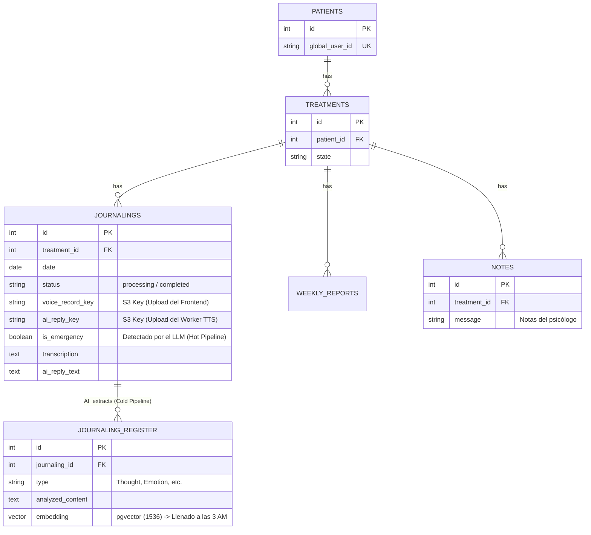

# Arquitectura y Diseño Detallado: MVP Journal Psicológico

Este documento consolida la arquitectura definitiva para el flujo de procesamiento de audio, transcripción y apoyo emocional mediante IA, enfocado en baja latencia y alta seguridad.

## 1. Diagrama Lógico de Datos (ER)

## 2. Flujo de Datos: Hot Pipeline (Baja Latencia)

El objetivo de este flujo es proporcionar una respuesta de primeros auxilios emocionales al paciente en menos de 5 segundos. Todo el procesamiento analítico pesado (vectores y extracciones complejas) se delega al proceso nocturno (Cold Pipeline).

### Paso a Paso:
1. **Frontend a S3 (Directo):** El Frontend solicita al Backend una "Presigned URL" temporal y sube el archivo de audio (formato **M4A/AAC o MP3**) directamente a AWS S3 (LocalStack).
2. **Frontend a Backend:** El Frontend notifica al Backend (`POST`) que la subida terminó, enviando el `s3Key`.
3. **Backend a SQS:** El Backend registra el diario en PostgreSQL con `status = 'processing'` y encola una tarea en AWS SQS.
4. **Worker (Python) - Descarga y STT:** El Worker toma la tarea de SQS, descarga el audio de S3 y usa OpenAI Whisper para transcribirlo.
5. **Worker - Dynamic Prompt & LLM:** El Worker consulta PostgreSQL para obtener el contexto clínico del paciente y construye el siguiente *System Prompt*:
   > "Eres un asistente de apoyo emocional de primera línea. El paciente acaba de grabar un diario de voz. Tu objetivo es brindarle un consejo breve, puntual y accionable (máximo 2 párrafos cortos). NO eres su psicólogo. Usa un tono cálido y empático. Debes detectar emergencias graves (ideación suicida, crisis severa)."
   El LLM (`gpt-4o-mini`) devuelve un JSON con el consejo de texto y un booleano `is_emergency`.
6. **Worker - TTS y Subida:** El Worker convierte el consejo a audio usando OpenAI TTS-1 (formato MP3) y lo sube a S3.
7. **Worker - Actualización DB:** El Worker actualiza PostgreSQL: `status = 'completed'`, guarda las transcripciones, y marca `is_emergency`. Borra la tarea de SQS.
8. **Frontend Polling & Alerta Backend:** El Frontend, que consultaba al Backend periódicamente (`GET`), recibe finalmente el `status = 'completed'` y la Presigned URL para reproducir la respuesta. Si el Backend detecta que `is_emergency = true`, envía una simulación de correo/notificación al psicólogo.

## 3. Guía de Implementación por Servicio

### Base de Datos (PostgreSQL)
- **Imagen Docker:** `pgvector/pgvector:pg15` para soportar `vector(1536)`.
- **Estructura Crítica:** Las tablas vectoriales se mantienen vacías de día. La tabla `journalings` es el corazón del polling y debe tener índices en `treatment_id` y `status`.

### Backend (C# .NET)
- Responsable exclusivo de generar firmas criptográficas para S3 (Presigned URLs) y mantener el estado de la base de datos de cara al frontend. 
- Módulo simplificado de AWS (ej. `AwsHelper.cs`) que expone funcionalidades crudas sin abstracciones innecesarias para facilitar su lectura.
- Dispara notificaciones asíncronas de emergencia (ej. Correo Simulado) cuando el Frontend hace fetch de un journal completado que está marcado como emergencia.

### Worker (Python Daemon)
- Un proceso que corre en ciclo continuo consumiendo memoria mínima (Long Polling SQS).
- Estandarización de inputs en MP3/M4A para minimizar dependencias de conversión de audio complejas.
