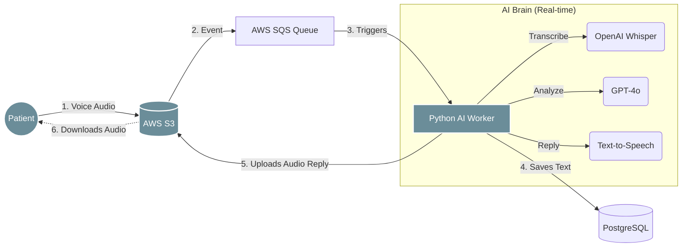
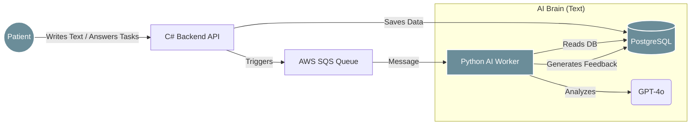
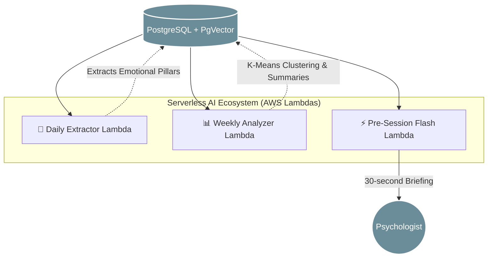
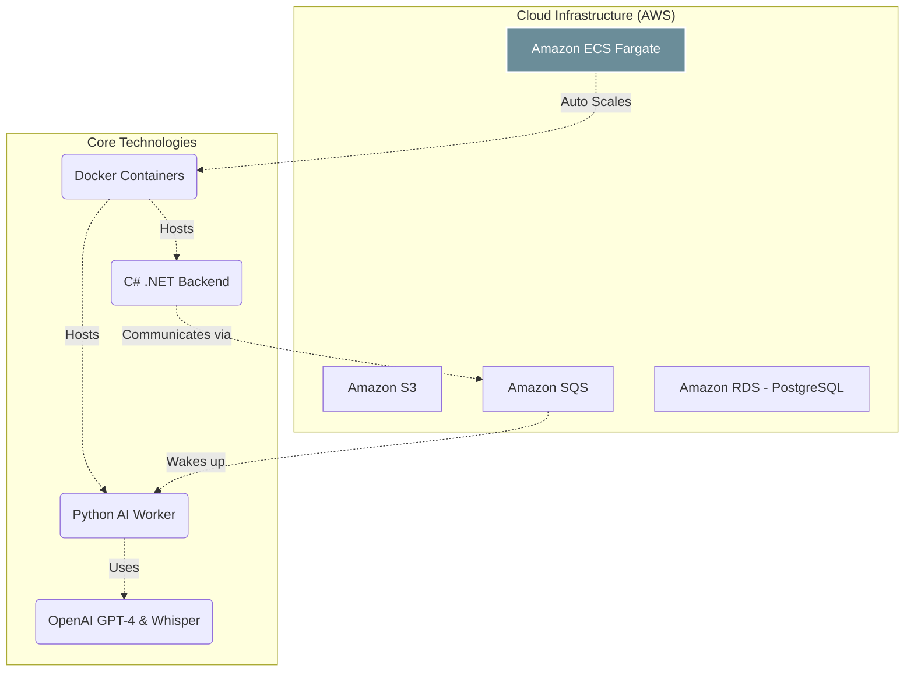

# MindLens: Pitch Presentation Guide (Technical Section)

Este documento contiene la estructura visual y el guion exacto (adaptado para un nivel B1 de inglés) de la sección técnica que presentarás. Se ha dividido en las diapositivas visuales (diagramas para apoyar tu discurso) y el texto exacto que debes memorizar y hablar.

---

## 📌 Slide 3.1 & 3.3: Business Infrastructure & Voice Flow

### 🖼️ Ayuda Visual (Diagrama de Voz)

*Colores aplicados basados en la paleta de la app: Azul Primario (#6B8D99) y Rojo Alerta (#A32A2A).*

### 🗣️ Texto del Pitch (Lo que vas a decir)

> "Hello everyone. I am in charge of the infrastructure and the Artificial Intelligence, so I will explain how MindLens works behind the scenes.
>
> Our system is built to connect patients and AI in real time. We use a microservices architecture. Our main backend is built in C#, but the real magic happens in our AI Worker, which is built in Python. Why Python? Because it is the best language for AI.
>
> The flow is simple: When a patient records a voice journal, the audio goes to **AWS S3**. Then, an **AWS SQS queue** sends a message to our Python worker. The worker downloads the audio, uses **OpenAI's Whisper** to transcribe the voice, and uses **GPT-4** to create an empathetic response.
>
> Finally, we convert this response into audio using Text-to-Speech and upload it back to S3. The patient's app then downloads and plays this audio, delivering useful, empathetic advice directly to them. All this happens in seconds."

---

## 📌 Slide 3.1.2: Text-Based & Task Flow (Infraestructura Alterna)

### 🖼️ Ayuda Visual (Diagrama de Texto y Tareas)

### 🗣️ Texto del Pitch (Lo que vas a decir)

> "Of course, we also support a text-based flow. If the patient prefers to write, or if they need to answer specific questions assigned by their psychologist as a task, our infrastructure handles it perfectly.
>
> The text is securely stored in our **PostgreSQL database** by our C# API. Then, it triggers the same Python Worker. The AI reads the text directly from the database, analyzes it, and provides the same empathetic feedback. This seamlessly integrates the psychologist's assignments into the patient's daily life."

---

## 📌 Slide 3.2: The Asynchronous Brain (AWS Lambdas)

### 🖼️ Ayuda Visual (Diagrama de Lambdas)

### 🗣️ Texto del Pitch (Lo que vas a decir)

> "But the real value of MindLens happens when the patient is offline. We built a system of three serverless **AWS Lambdas** powered by Vector Databases.
>
> First, the **Daily Extractor**. Every night, it reads the patient's journals, extracts emotional pillars like anxiety or stress, and saves them as vectors.
>
> Second, the **Weekly Analyzer**. It groups these vectors to find recurrent behavioral patterns, creating a clinical summary of the week.
>
> Third, the **Pre-Session Flash Briefing**. On the morning of a therapy session, it synthesizes the entire week into a 30-second bullet-point summary for the psychologist.
>
> **The impact is huge:** Patients get continuous tracking without filling out boring forms. And psychologists save hours of reading and listening. They can enter the session 100% prepared, focusing on therapy instead of catching up."

---

## 📌 Slide 3.3: Tech Ecosystem & Scalability

### 🖼️ Ayuda Visual (Ecosistema de Tecnologías)

*Para esta diapositiva, puedes mostrar los logotipos de todas las herramientas trabajando juntas, o usar este diagrama de integración.*

### 🗣️ Texto del Pitch (Lo que vas a decir)

> "Finally, let's talk about scalability and our technology ecosystem. Processing audio and AI requires a lot of computing power.
>
> To solve this, all our core technologies—C# and Python—are containerized with **Docker**. We deploy these containers using **AWS ECS Fargate**. This means our infrastructure is highly scalable.
>
> If we have a thousand patients recording audios at the same time, AWS Auto Scaling detects the load and automatically creates more Python workers. When the traffic drops, it removes the extra workers to save money. Everything connects seamlessly: C#, Python, PostgreSQL, and OpenAI, working as one single brain.
>
> In summary, we built a modern, secure, and cloud-native architecture ready to grow."

---

### 💡 Tips para tu exposición:

- Practica frente a un espejo leyendo el texto **con pausas** entre cada oración. No hay prisa.
- Cuando llegues a la parte del impacto ("The impact is huge"), haz énfasis en tu voz. Es el argumento de venta principal de tu tecnología.
- Usa tus manos para apuntar a los diagramas Mermaid cuando hables del Worker y las Lambdas, eso restará atención a tu pronunciación y te dará mucha postura técnica.

