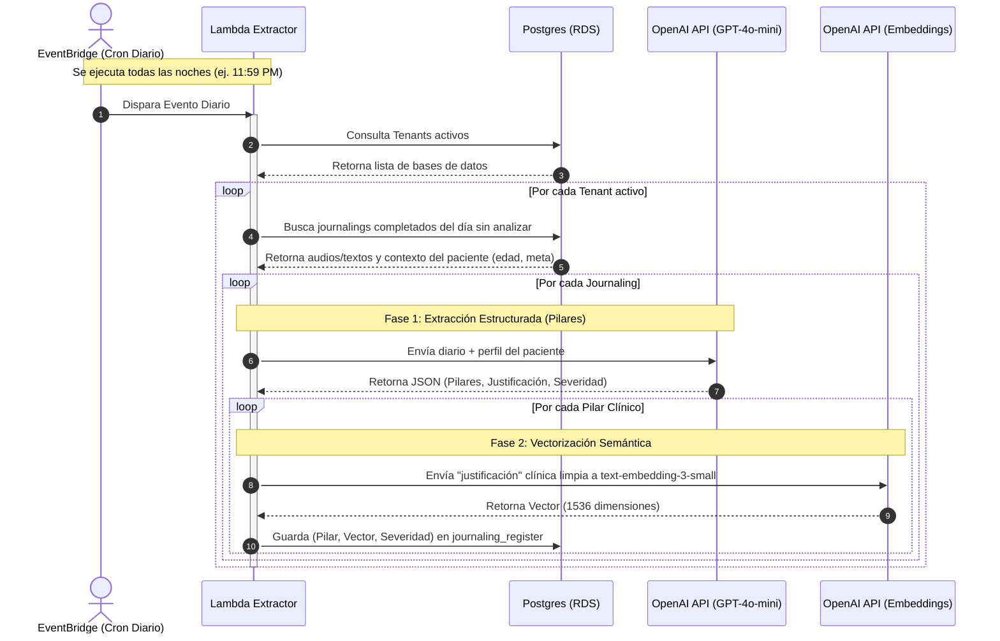

# 🧠 Extractor de Pilares Clínicos (Diario)

Esta función Lambda es el **primer motor de Inteligencia Artificial asíncrono** de la plataforma. Su objetivo es ejecutarse en segundo plano (idealmente cada noche mediante AWS EventBridge) para procesar de forma masiva todos los diarios (`journalings`) que los pacientes completaron durante el día.

## Arquitectura y Flujo de Datos

A continuación se presenta el diagrama de arquitectura de esta Lambda:



## Descripción de los Pasos

1. **Escaneo de Base de Datos:** Busca todos los `journalings` cuyo `status = 'completed'` pero que aún no tienen registros asociados en la tabla `journaling_register` para el día en cuestión.
2. **Inyección de Contexto:** Extrae el perfil demográfico y clínico del paciente (edad, ocupación, meta de terapia) haciendo un `JOIN` con las tablas `treatments` y `patients`. Esto asegura que la IA interprete el diario a través de la lupa correcta (no es lo mismo la ansiedad en un estudiante de 18 años que en un CEO de 50 años).
3. **Prompt Engineering (Estructurado):** Envía la transcripción del diario junto con el contexto del paciente al modelo `gpt-4o-mini`, forzando una respuesta en formato JSON estricto.
4. **Extracción y Vectorización:**
   - La IA clasifica los insights en **Pilares** (ej. "Nivel de Estrés", "Autoestima", o pilares dinámicos si la situación lo amerita).
   - Por cada pilar, redacta una **justificación** (un resumen clínico de máximo 150 caracteres).
   - Genera un **nivel de severidad** (1 al 5) y un **nivel de confianza** (0.00 al 1.00).
   - **Paso Crítico:** Toma la `justificación` (el resumen limpio y clínico, *no la transcripción cruda del paciente*) y la envía al modelo `text-embedding-3-small` para convertirla en un vector semántico de 1536 dimensiones.
5. **Persistencia (PgVector):** Guarda todo este paquete (Pilar, Justificación, Severidad, Confianza y su Embedding Vectorial) en la tabla `journaling_register` para ser consumido posteriormente por la Lambda de Reportes Semanales (Clustering).

## Tecnologías Involucradas

- **Python 3.11:** Lenguaje de programación base.
- **psycopg2-binary:** Conexión y operaciones a PostgreSQL.
- **pgvector:** Extensión de Postgres para almacenar y consultar los embeddings matemáticos.
- **OpenAI API (gpt-4o-mini):** Motor de IA Generativa para la estructuración y análisis clínico.
- **OpenAI API (text-embedding-3-small):** Motor de IA para la vectorización semántica de alta calidad.
- **Docker:** Contenedorización para pruebas y simulación histórica.
- **AWS Lambda & EventBridge:** Entorno de ejecución Serverless y programador de eventos cron (nocturno).

## Cómo ejecutar y simular localmente

Para probar o reconstruir los vectores de forma local sin depender del cron de EventBridge, hemos creado el script `simulate_time.py`. Éste permite simular el paso de los días de forma histórica iterando sobre un rango de fechas e inyectando un `target_date` en el evento de la Lambda.

Desde la raíz de tu proyecto (donde está el archivo `.env`), ejecuta este comando Docker:

```bash
docker run --rm --env-file .env -v "${PWD}:/app" -w /app/lambda/extractor_pilares --network infra-docker-prueba_journal-net python:3.11-slim bash -c "pip install openai psycopg2-binary python-dotenv && python simulate_time.py"
```

> **🛡️ Tolerancia a Fallos:** La Lambda posee manejo de errores individualizado por cada registro. Si la API de OpenAI sufre un timeout, o si la IA alucina un JSON inválido, la Lambda hace un `rollback()` local aislando únicamente a ese paciente, y continúa sin problemas con el resto del lote masivo para asegurar la estabilidad del proceso batch.

## Estructura del Código

- `app.py`: Lógica principal del handler, consultas SQL y doble llamada a OpenAI (Texto + Embeddings).
- `simulate_time.py`: Script simulador de "viaje en el tiempo" para ejecutar el pipeline histórico local.
- `requirements.txt`: Dependencias del entorno de AWS Lambda.

## Esquema de Base de Datos (Destino)

Los datos estructurados y vectorizados se guardan en la tabla `journaling_register` con la siguiente estructura:

| Columna | Tipo | Descripción |
| :--- | :--- | :--- |
| `pillar_type` | `VARCHAR(100)` | El nombre del pilar extraído (Ej. "Ansiedad Social"). |
| `analyzed_content` | `TEXT` | La justificación clínica redactada por la IA en 3ra persona. |
| `severity_score` | `INTEGER` | Nivel del 1 al 5. |
| `confidence_score` | `NUMERIC(3,2)` | Nivel de certeza de la IA (Ej. 0.85). |
| `embedding` | `vector(1536)` | Vector matemático que representa el `analyzed_content`. |
