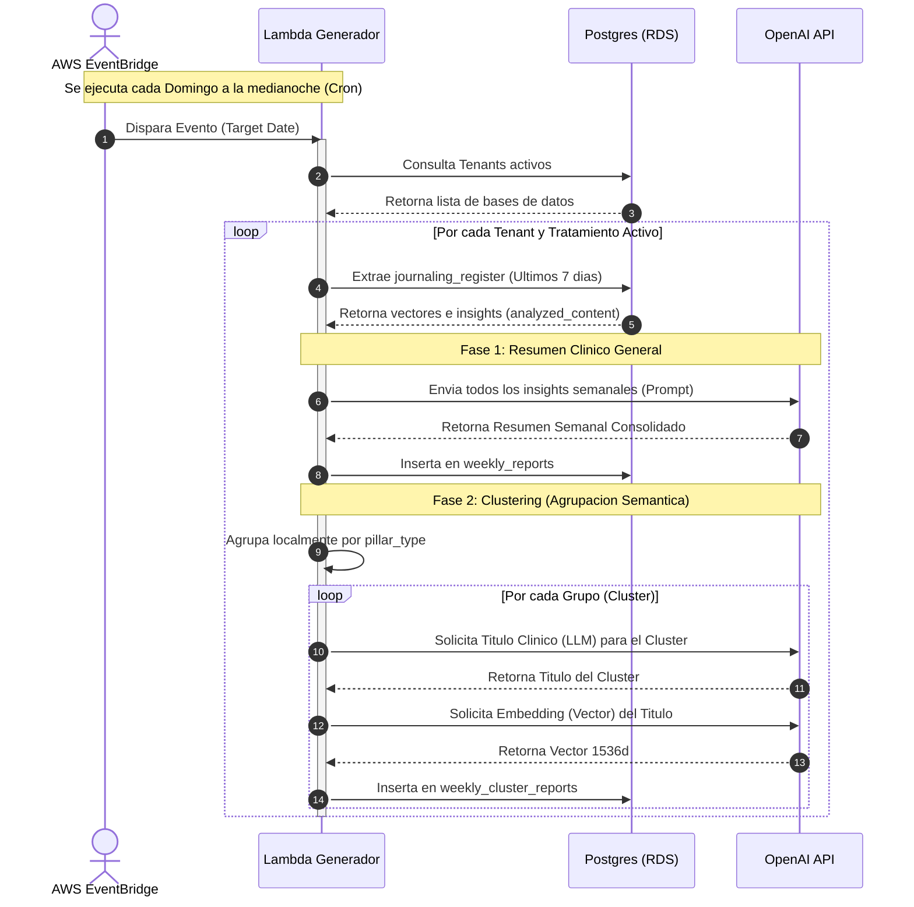

# Generador de Reportes Semanales (Cold Pipeline)

Esta funcion Lambda representa la segunda fase de Inteligencia Artificial asincrona de la plataforma. Su proposito es ejecutarse semanalmente para consolidar los insights diarios de un paciente, agruparlos semanticamente mediante IA y generar reportes clinicos de alto nivel para el psicologo.

## Arquitectura y Flujo de Datos

A continuacion se presenta el diagrama de arquitectura y flujo de ejecucion de la Lambda en el ecosistema AWS.

## Descripcion de los Pasos (Diagrama)

1. **Disparo Programado:** AWS EventBridge (mediante una regla Cron) despierta la Lambda todos los domingos a la medianoche. Inyecta la fecha actual como `target_date`.
2. **Descubrimiento de Tenants:** La Lambda se conecta a la base de datos `master_db` para obtener la lista de bases de datos inquilinas activas.
3. **Consulta de Rango Semanal:** Por cada tratamiento activo, la Lambda calcula el rango de fechas (target_date - 7 dias) y extrae todos los registros de `journaling_register`.
4. **Resumen General (IA Generativa):** Todos los textos de `analyzed_content` extraidos en los 7 dias se concatenan y se envian a GPT-4o-mini para redactar un resumen clinico cohesivo de la evolucion del paciente. El resultado se guarda en `weekly_reports`.
5. **Agrupacion Local:** La Lambda toma los registros y los agrupa en memoria segun su `pillar_type` (Ej. Todo lo de "Estres" junto, todo lo de "Autoestima" junto).
6. **Sintesis de Cluester (IA Generativa):** Por cada grupo, se envian sus textos a GPT-4o-mini para que redacte un "Titulo" unico que resuma el comportamiento especifico de ese pilar durante la semana.
7. **Vectorizacion (IA Embeddings):** Ese nuevo Titulo generado es enviado a la API de embeddings (`text-embedding-3-small`) para obtener su representacion vectorial ultra-precisa.
8. **Persistencia Final:** El vector, el titulo y la cantidad de repeticiones se insertan en la tabla `weekly_cluster_reports`. Esto permite que el motor de busqueda por similitud del Dashboard del psicologo opere sobre conceptos semanales consolidados.

## Estructura del Codigo

- `app.py`: Logica principal, consultas SQL y orquestacion de las llamadas a OpenAI.
- `simulate_weekly.py`: Script para viajar en el tiempo y procesar reportes semanales historicos pasandole parametros de fecha especificos.
- `requirements.txt`: Dependencias de empaquetado para AWS.
