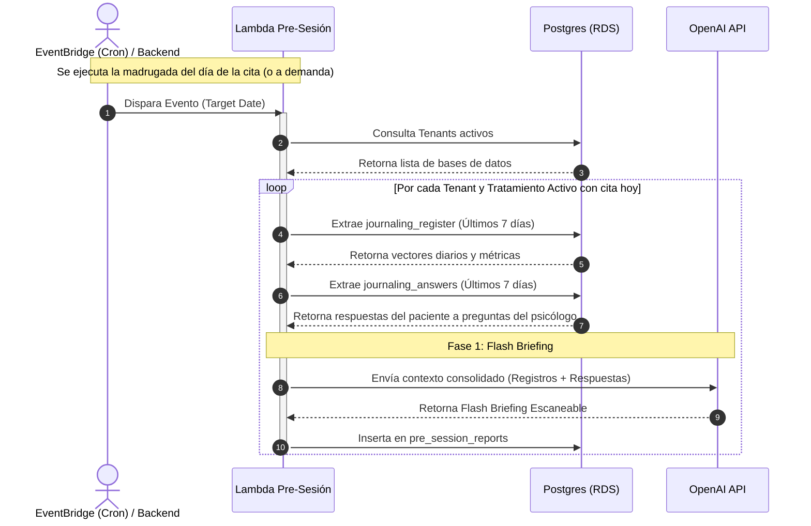

# Reporte Pre-Sesión (Flash Briefing)

Esta función Lambda genera un reporte ultracorto (Flash Briefing) preparado específicamente para ser consumido por el psicólogo minutos antes de iniciar una sesión clínica con el paciente.

## Arquitectura y Flujo de Datos

A continuación se presenta el diagrama de arquitectura y flujo de ejecución de la Lambda en el ecosistema AWS.



## Descripción de los Pasos (Diagrama)

1. **Disparo Programado / A Demanda:** AWS EventBridge (o el orquestador del Backend) despierta la Lambda el día de la cita del paciente. Inyecta la fecha de la cita como `target_date`.
2. **Descubrimiento de Tenants:** La Lambda se conecta a la base de datos `master_db` para obtener la lista de bases de datos inquilinas activas.
3. **Consulta de Rango Semanal:** Por cada tratamiento con cita programada, la Lambda extrae todos los registros de `journaling_register` de los **últimos 7 días exactos** previos a la sesión.
4. **Consulta de Respuestas:** La Lambda extrae también las respuestas del paciente (`journaling_answers`) a consignas o seguimientos que el psicólogo le haya dejado para la semana.
5. **Síntesis Clínica (IA Generativa):** Todos los textos recopilados se envían a GPT-4o-mini con un prompt estricto. La IA redacta un "Flash Briefing" de 4 a 6 viñetas enfocado puramente en puntos críticos a tratar, riesgos, cambios repentinos y respuestas a tareas.
6. **Persistencia Final:** El reporte se inserta en la tabla `pre_session_reports` para que el Dashboard del psicólogo lo muestre en tiempo real.

## Tecnologías Involucradas

- **Python 3.11:** Lenguaje de programación base.
- **psycopg2-binary:** Conexión y operaciones directas a PostgreSQL.
- **OpenAI API (gpt-4o-mini):** Motor de IA Generativa para sintetizar y formatear el Flash Briefing.
- **Docker:** Contenedorización para pruebas y ejecución local.
- **AWS Lambda & EventBridge:** Entorno de ejecución Serverless y programador de eventos cron en la nube.

## Cómo ejecutar localmente (Simulador)

Para poblar las bases de datos con un ejemplo y simular la generación del reporte, primero asegúrate de que la infraestructura tenga los datos semilla (ejecutando `teardown_poc.ps1` y `start_project.ps1` en la raíz del proyecto para reiniciar la DB con los datos simulados).

Luego, corre el simulador usando Docker, el cual "viajará en el tiempo" a una fecha específica de prueba (ej. Lunes 29 de Junio de 2026):

```bash
docker run --rm --env-file .env -v "${PWD}:/app" -w /app/lambda/reporte_pre_sesion --network infra-docker-prueba_journal-net python:3.11-slim bash -c "pip install openai psycopg2-binary python-dotenv && python simulate_appointment.py"
```

## Estructura del Código

- `app.py`: Lógica principal, consultas SQL (incluyendo JOINs de respuestas y registros) y orquestación de la llamada a OpenAI.
- `simulate_appointment.py`: Script simulador para ejecutar la Lambda localmente bajo demanda.
- `requirements.txt`: Dependencias de empaquetado y dependencias externas.
